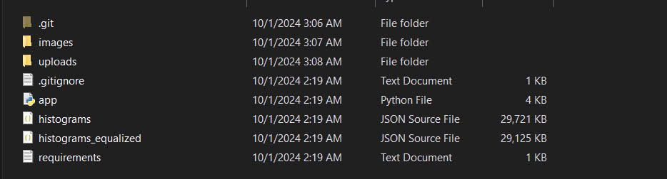

# :sunglasses: Image Histogram Comparison API 

This Flask-based API allows users to upload an image and compare its histogram with a database of stored images to find the most similar images. The API supports both equalized and non-equalized histograms.

## 🌟 Features
- Upload an image and calculate its histogram.
- Compare the uploaded image's histogram with stored images.
- Retrieve the top N most similar images based on Euclidean distance.
- Option to use equalized histograms for better comparison.

## 🛠️ Requirements

Before running the project, make sure you have the following installed:
- Python 3.x, 3.12.6 __(Recommend)__
- Flask 3.0.3
- OpenCV 4.10.0
- NumPy 2.1.1
- SciPy 1.14.1
- Flask-CORS 5.0.0

You can install all dependencies by running:

```
pip install -r requirements.txt
```

## 🚀 Getting Started
1. Clone the repository:
```
git clone https://github.com/Havold/CS406-Lab02-BE-Raw.git
cd CS406-Lab02-BE-Raw
```
2. Install dependencies:
```
pip install -r requirements.txt
```
3. Set up the directory structure:
   - Download dataset and create an __images__ folder in the root directory and put the dataset in the images folder just created (remember to unzip).
   - The structure will be like this: __CS406-Lab02-BE-Raw/images/seg__, __CS406-Lab02-BE-Raw/images/seg_test__ (__seg_test__ doesn't need to be put in because we only query in the seg folder).
   - Link dataset: https://drive.google.com/file/d/1F6sPtl0H-Sh7XPrAojDKcz_rBoUl_fgu/view?usp=sharing

4. Run the Flask server:
```
python app.py
```
5. The server will start at http://localhost:5000.

## ⚠️ Important Notice
- The two files __histograms_equalized.json__ and __histograms.json__ are generated from the __create-json-file.ipynb__.
- You can download and run __create-json-file.ipynb__ here: https://drive.google.com/file/d/15uB2WsK3YFxfee1_cC2OmF5BN7rF4-iM/view?usp=sharing
---------------------------------------------------------
# :sunglasses: API Tính khoảng cách và tìm các ảnh tương đồng thông qua histogram

API dựa trên Flask này cho phép người dùng tải lên hình ảnh và so sánh biểu đồ histogram của hình ảnh đó với cơ sở dữ liệu hình ảnh được lưu trữ để tìm ra hình ảnh giống nhau nhất. API hỗ trợ cả biểu đồ histogram cân bằng và không cân bằng.

## 🌟 Tính năng
- Tải lên một hình ảnh và tính toán histogram của nó.
- So sánh histogram của hình ảnh được tải lên với hình ảnh đã lưu trữ.
- Lấy N hình ảnh giống nhau nhất dựa trên khoảng cách Euclid.
- Tùy chọn sử dụng equalized histogram để so sánh tốt hơn.

## 🛠️ Requirements

Trước khi chạy dự án, hãy đảm bảo bạn đã cài đặt các dependencies sau:
- Python 3.x, 3.12.6 __(Đề xuất)__
- Flask 3.0.3
- OpenCV 4.10.0
- NumPy 2.1.1
- SciPy 1.14.1
- Flask-CORS 5.0.0

Bạn có thể cài đặt tất cả các thư viện trên bằng cách chạy:

```
pip install -r requirements.txt
```

## 🚀 Bắt đầu thôi!
1. Clone dự án về
```
git clone https://github.com/Havold/CS406-Lab02-BE-Raw.git
cd CS406-Lab02-BE-Raw
```
2. Cài đặt các dependencies:
```
pip install -r requirements.txt
```
3. Thiết lập cấu trúc thư mục:
   - Tải xuống dataset và tạo một thư mục __images__ trong thư mục gốc và đặt dataset vừa tải về vào thư mục __images__ vừa tạo (nhớ giải nén).
   - Cấu trúc thư mục sẽ như sau: __CS406-Lab02-BE-Raw/images/seg__, __CS406-Lab02-BE-Raw/images/seg_test__ (__seg_test__ có thể cần phải đưa vào vì chúng ta sẽ chỉ truy vấn trong thư mục seg).
   - Link dataset: https://drive.google.com/file/d/1F6sPtl0H-Sh7XPrAojDKcz_rBoUl_fgu/view?usp=sharing

4. Chạy Flask server:
```
python app.py
```
5. Server sẽ chạy ở: http://localhost:5000.

## ⚠️ Lưu ý quan trọng
- Hai file __histograms_equalized.json__ và __histograms.json__ được tạo từ __create-json-file.ipynb__.
- Bạn có thể tải xuống và chạy __create-json-file.ipynb__ tại đây: https://drive.google.com/file/d/15uB2WsK3YFxfee1_cC2OmF5BN7rF4-iM/view?usp=sharing
